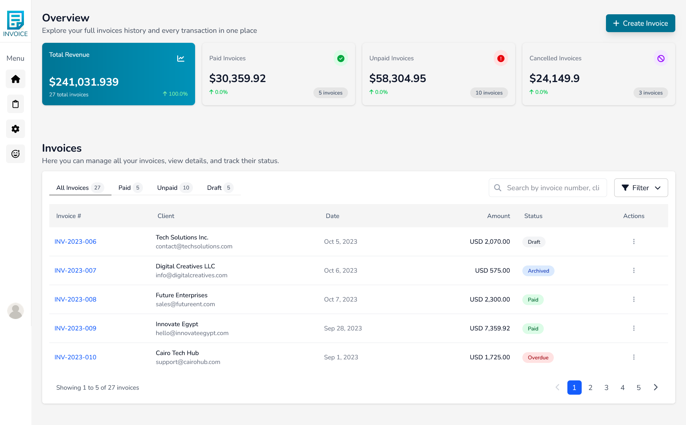

# Invoice Generator System

A modern web app to create, manage, and export professional invoices.

## Overview

The Invoice Generator System is a comprehensive web application designed to help businesses create, manage, and track invoices efficiently. Built with modern web technologies, this application provides a user-friendly interface for generating professional invoices, tracking payments, and managing client information.

## Features

- **Dashboard Overview**: View key metrics including total revenue, paid/unpaid invoices, and monthly statistics
- **Invoice Management**: Create, edit, view, and delete invoices
- **Client Management**: Store and manage client information for quick invoice generation
- **Product/Service Catalog**: Maintain a catalog of products and services with pricing
- **Dynamic Invoice Generation**: Create professional invoices with customizable fields
- **Invoice Templates**: Use pre-designed templates for consistent invoice styling
- **Payment Tracking**: Monitor payment status (paid, pending, draft, cancelled)
- **Currency Support**: Multiple currency options (USD, EGP) with automatic calculations
- **Tax and Discount Calculations**: Apply tax rates and discounts (fixed or percentage)
- **Export Options**: Save invoices as PDF or print directly
- **Responsive Design**: Works seamlessly across desktop and mobile devices

## Technology Stack

- **Frontend**: React 19 with TypeScript
- **State Management**: Redux Toolkit
- **Styling**: Tailwind CSS
- **Form Handling**: React Hook Form with Zod validation
- **Routing**: React Router
- **Icons**: Font Awesome
- **Date Handling**: date-fns
- **Backend Mock**: JSON Server (for development)

## Preview

# screenshots




# Live Demo

You can try the app here: [Live Demo](https://invoice-generator-system-j9f3.vercel.app/)

## Getting Started

### Prerequisites

- Node.js (latest LTS version recommended)
- npm or yarn

### Installation

1. Clone the repository
2. Install dependencies:
   ```
   npm install
   ```
3. Start the development server:
   ```
   npm run dev
   ```
4. Start the mock backend server:
   ```
   npm run server
   ```

## Usage

1. **Dashboard**: View invoice statistics and create new invoices
2. **Create Invoice**: Fill in client details, add products/services, set tax rates and discounts
3. **Preview Invoice**: Review the invoice Details and manage it's status
4. **Manage Invoices**: Filter invoices by status, date, or amount
5. **Edit/Update**: Modify existing invoices as needed

## Project Structure

- `/src/app`: Redux store configuration
- `/src/components`: Reusable UI components
- `/src/features`: Feature-based modules (invoices, clients, products)
- `/src/pages`: Main application pages
- `/src/utils`: Utility functions for date handling, currency conversion, etc.
- `/src/hooks`: Custom React hooks
- `/data`: Mock database for development

## 👨‍💻 About the Developer

**Khaled Sameh** – Full Stack Developer with a passion for building scalable and user-friendly web applications.

- 📫 Email: khaledsameh158@gmail.com
- 💬 LinkedIn: [linkedin.com/in/khaled-sameh](https://www.linkedin.com/in/khaled-sameh-940295272/)
- 💼 GitHub: [@khaled-sameh-dev](https://github.com/khaled-sameh-dev)

> Feel free to check out more of my projects or reach out for collaboration!
